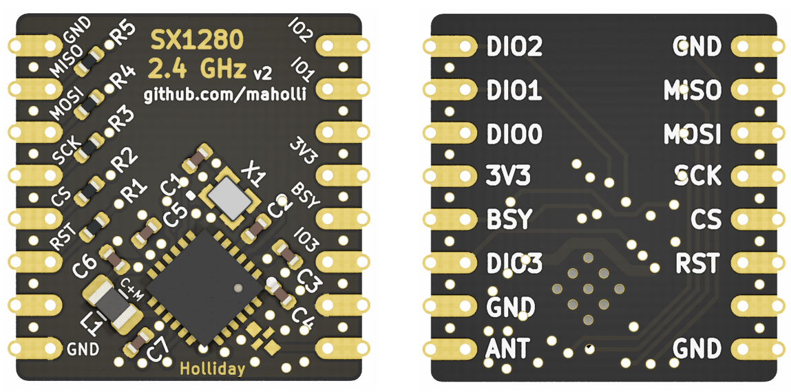

# sx1280-breakout
breakout board for Semtech SX1280 LoRa radio compatible with RFM9x footprints

 - [ ] TODO: add cleverly-optional U.FL to antenna signal path

## [Schematic (PDF)](SX1280-breakout.pdf)

<p align="middle">
  
</p>

## Stack up
Assuming Isola FR408
 - layer 1 1.7mils 1oz Cu
 - 7.5 mils prepreg
 - layer 2 1.4 mils 1oz Cu
 - 40 mils core
 - layer 3 1.4 mils 1oz Cu
 - 7.5 mils prepreg
 - layer 4 1.7mils 1oz Cu

For coplanar wave guide with ground plane:
 - 50 ohm at 2.4G = 7.65 mils trace width with spacing of 5 mils.

# KiKit Panelize
```bash
kikit panelize \
    --layout 'alternation: cols; hspace: 2.4mm; vspace: 2.4mm; cols: 4' \
    --source 'tolerance: 15mm' \
    --tabs 'type: annotation' \
    --cuts 'type: mousebites; offset: -0.1mm' \
    --framing 'type: railstb; vspace: 2.4mm; width: 3mm' \
    --fiducials 'type: 3fid; hoffset: 1.5mm; voffset: 1.5mm; opening: 2mm' \
    --post 'millradius: 1.2mm; origin: bl' \
    \GitHub\sx1280-breakout\SX1280-breakout.kicad_pcb panel.kicad_pcb
```
